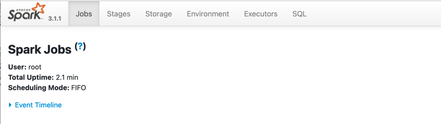

# Step 3

Start the PySpark shell by typing: `pyspark`{{execute}}  (inside the container)

Go back to the terminal session on the host and verify the processes running on the os: `pstree -c -p -A $(pgrep pyspark)`{{execute}}  
You should see an output similar to:  
```
systemd(1)-+-ModemManager(609)-+-{ModemManager}(648)
           |                   `-{ModemManager}(651)
           |-NetworkManager(499)-+-{NetworkManager}(615)
           |                     `-{NetworkManager}(616)
           |-accounts-daemon(493)-+-{accounts-daemon}(544)
           |                      `-{accounts-daemon}(582)
           |-agetty(645)
           |-containerd(622)-+-containerd-shim(21392)-+-bash(21409)
           |                 |                        |-bash(21492)---python3(21515)-+-java(21542)-+-{java}(21554)
           |                 |                        |                              |             |-{java}(21555)
           |                 |                        |                              |             |-{java}(21556)
       
```
  
The PySpark process is a native Linux process! There's no hidden virtual machine running Linux in the middle like on your Windows/MacOS workstation.  

Now you can also see the SparkHistory, by doing: "View HTTP port 80 on Host 1", this will open a web-page like this:



## Reading json file content into a Spark Dataframe
From inside the Pyspark shell: 
```
spark = SparkSession.builder.appName("MyFirstPySpark").getOrCreate()
sample_file = spark.read.json('/opt/raw_tweets.json')
```{{execute}}

`sample_file` is a Spark dataframe. To print the schema: `sample_file.printSchema()`{{execute}}  
To count the records: `sample_file.count()`{{execute}}  

To query the dataframe
```
sample_file.select('id','text').show(vertical=True,truncate=False)
```{{execute}}

Go back the SparkHistory page and observer whats happening.  
